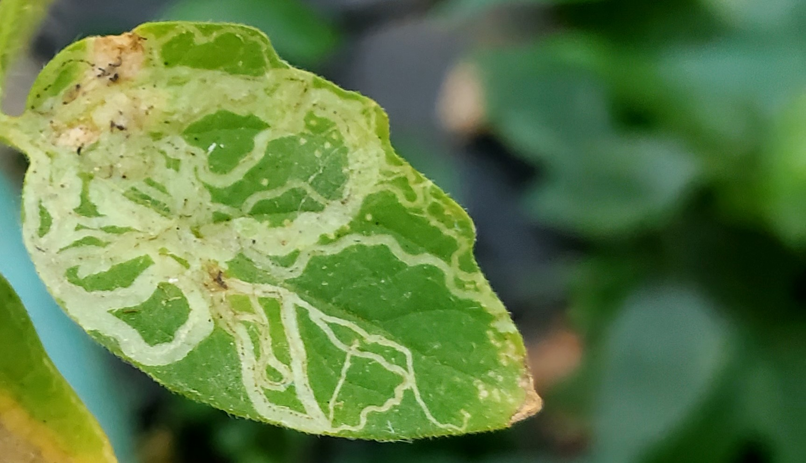
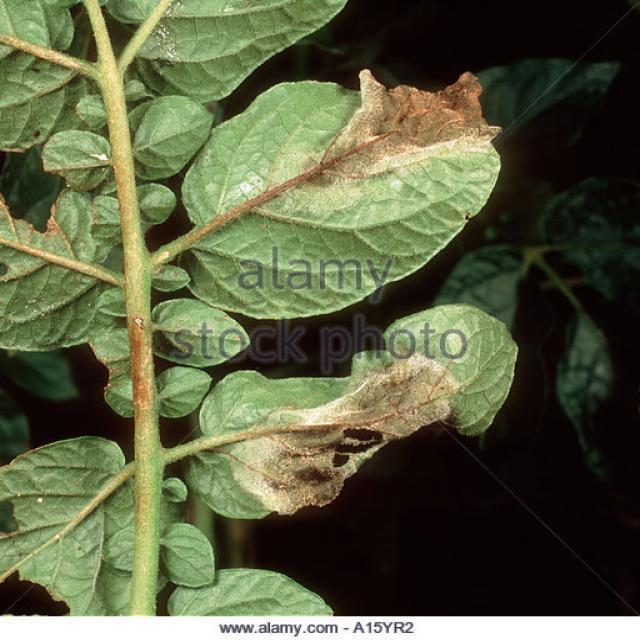

# 🌿 Plant Disease Detection

A deep learning project that uses the InceptionV3 model to detect plant diseases from leaf images. The goal is to assist farmers and agricultural experts in identifying plant health issues early, enabling timely intervention and improving crop yield.

---

## 📌 Features

- Image classification for plant disease detection
- Transfer learning with InceptionV3
- Fine-tuning by freezing/unfreezing layers
- Trained on a dataset of healthy and diseased plant leaves
- High accuracy and low inference time

---

## 🖼️ Sample Predictions

| Input Leaf Image | Predicted Disease |
|------------------|-------------------|
|  | Tomato Leaf Miner |
|  | Tomato Late Blight |

---

## 🛠️ Installation

```bash
git clone https://github.com/yourusername/plant-disease-detection.git
cd plant-disease-detection
pip install -r requirements.txt
